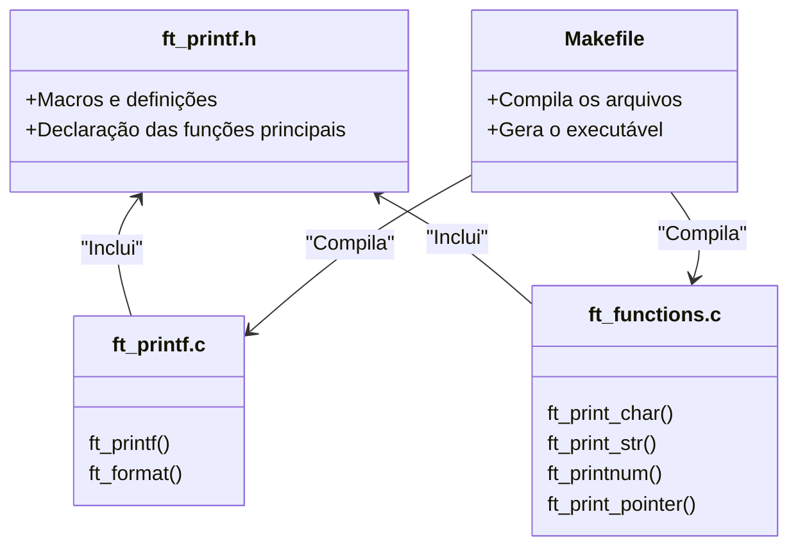

<a name="readme-top"></a>
<div align="center">


# About :pushpin:

</div>

<div align=center>

> Because `ft_putnbr()` and `ft_putstr()` aren't enough!

This project is an exploration into how `printf()` works. The objective is to write a library that mimics the behaviour of `printf()`. A re-code challenge with the aim of revealing how `variadic functions` work in C. This project is an exercise on how to build a well-planned, well-structured extensible code base.

[ft_printf (Subject English)](/ft_printf.en.subject.pdf)


____

<div align="left">

# Implementation :scroll:

In this project `printf()` is implemented with the following prototype:

```c
void	ft_printf(const char *format, ...);
```

## Constrains 

- To accomplish this, the implementation is limited to the use of [libft](https://github.com/PedroZappa/libft) (which makes its performance slower than the standard `printf()`) and a restricted set of standard functions.

    > For **memory allocation** and **deallocation**: `malloc()` and `free()`; 
    >
    > To **write** into the allocated memory: `write()`;
    >
    > To support **variadic functionality**: `va_start()`, `va_arg()`, `va_copy()`, `va_end()`;

- `ft_printf()` doesn't handle overflows and unexpected inputs the same way the real `printf()` would.

## Mandatory Requirements:exclamation:

- Do NOT implement the buffer management of the original `printf()`;
- The function has to handle the following conversions (format specifiers):

    | Format | Meaning |
    |--------|---------|
    | `%c` | Prints a single `char`;
    | `%s` | Prints a string of characters (`char *`);
    | `%p` | Prints a Pointer Address in hexadecimal (`void *`);
    | `%d` | Prints a decimal (base 10) number;
    | `%i` | Prints an integer in base 10;
    | `%u` | Prints an unsigned decimal (base 10) number;
    | `%x` | Prints a number in hexadecimal (base 16) lowercase format;
    | `%X` | Prints a number in hexadecimal (base 16) uppercase format;
    | `%%` | Prints a `%` character;

- Format specifiers obey the following prototype:

    ```c
    %[flags][width][.precision]specifier
    ```

- The function must behave like `printf()`;

- The library has to be built using the command `ar`;


## Structure :construction:

#### Mandatory Files & Folder Structure

`ft_printf()`s mandatory code base has the following file structure:



